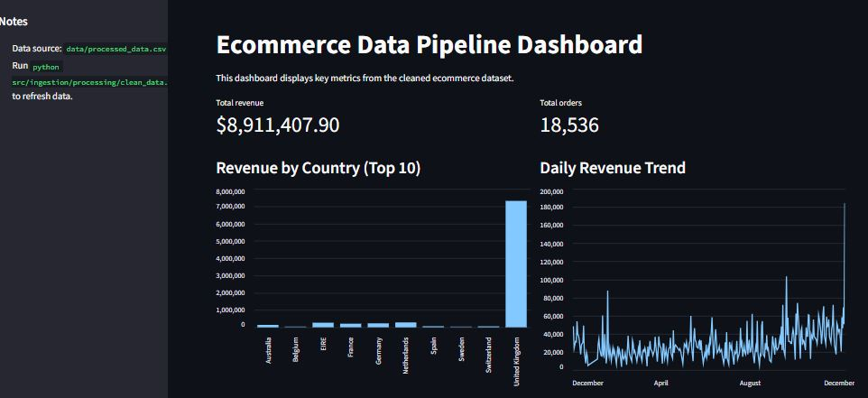
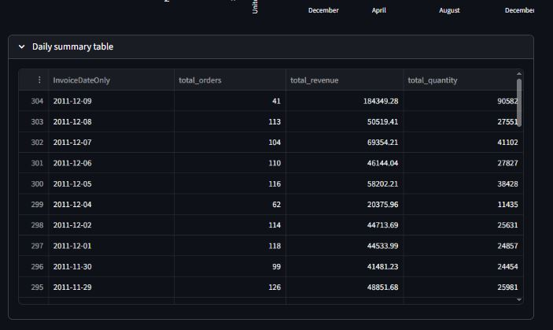

# ecommerce-data-pipeline - Data Engineering Zoomcamp final project 2026

An end-to-end batch analytics pipeline for ecommerce transactions built on Google Cloud. The project solves a simple business problem: raw order data is difficult to query directly, so the pipeline ingests the source CSV, cleans invalid records, stores files in a cloud data lake, loads structured data into BigQuery, builds analytics-ready tables, and serves a dashboard with business KPIs.

This project demonstrates a production-ready data pipeline with the following components:

- a clear problem statement and business context
- cloud services on Google Cloud Platform (GCP)
- infrastructure as code with Terraform
- an end-to-end batch processing pipeline
- a data warehouse layer in BigQuery
- transformations in both Python and SQL with optional dbt models
- a dashboard with multiple KPI tiles and visualizations
- reproducible setup instructions for local and cloud deployments

## Project Structure

```
ecommerce-data-pipeline/
├── dbt_project.yml
├── docker-compose.yml
├── Dockerfile
├── README.md
├── requirements.txt
├── test_pipeline.py
├── data/
│   ├── data.csv
│   └── processed_data.csv
├── dbt/
│   ├── profiles.yml.example
│   ├── README.md
│   └── models/
│       ├── schema.yml
│       ├── marts/
│       │   └── fct_daily_sales_summary.sql
│       └── staging/
│           └── stg_clean_orders.sql
├── images/
│   └── dashboard/
├── keys/
│   └── gcp-key.json
├── notebooks/
│   └── data_exploration.ipynb
├── processing/
├── src/
│   ├── __init__.py
│   ├── config.py
│   ├── dashboard/
│   │   ├── __init__.py
│   │   └── app.py
│   └── ingestion/
│       ├── __init__.py
│       ├── run_pipeline.py
│       ├── upload_to_gcs.py
│       ├── processing/
│       │   ├── __init__.py
│       │   └── clean_data.py
│       ├── sql/
│       │   ├── aggregate_orders.sql
│       │   └── clean_orders.sql
│       └── warehouse/
│           ├── __init__.py
│           ├── load_to_bigquery.py
│           └── transform_data.py
├── terraform/
│   ├── main.tf
│   ├── outputs.tf
│   ├── providers.tf
│   ├── README.md
│   ├── terraform.tfvars.example
│   ├── variables.tf
│   ├── versions.tf
│   └── modules/
│       ├── artifact_registry/
│       │   ├── main.tf
│       │   ├── outputs.tf
│       │   └── variables.tf
│       ├── bigquery/
│       │   ├── main.tf
│       │   ├── outputs.tf
│       │   └── variables.tf
│       ├── cloud_run_dashboard/
│       │   ├── main.tf
│       │   ├── outputs.tf
│       │   └── variables.tf
│       └── gcs_bucket/
│           ├── main.tf
│           ├── outputs.tf
│           └── variables.tf
└── warehouse/
```

## Dashboard Screenshots

Here are screenshots of the Streamlit dashboard displaying key ecommerce metrics:




## Final Review Submission

Submission links:

- GitHub repository: https://github.com/ZahidFarooqAI/ecommerce-data-pipeline
- Live dashboard demo: https://orange-lamp-v6gp9w6566jvhpq56-8501.app.github.dev/

Useful project evidence:

- Pipeline orchestration: [src/ingestion/run_pipeline.py](src/ingestion/run_pipeline.py)
- Warehouse transformations: [src/ingestion/warehouse/transform_data.py](src/ingestion/warehouse/transform_data.py)
- Dashboard app: [src/dashboard/app.py](src/dashboard/app.py)
- Terraform infrastructure: [terraform/main.tf](terraform/main.tf)
- dbt models: [dbt/models/staging/stg_clean_orders.sql](dbt/models/staging/stg_clean_orders.sql) and [dbt/models/marts/fct_daily_sales_summary.sql](dbt/models/marts/fct_daily_sales_summary.sql)

Useful commands for submission and review:

```bash
# 1. Install dependencies
pip install -r requirements.txt

# 2. Run the local smoke test
python test_pipeline.py

# 3. Generate the cleaned dataset locally
python src/ingestion/processing/clean_data.py

# 4. Launch the dashboard locally
streamlit run src/dashboard/app.py

# 5. Easiest full local demo
docker compose up --build
```

Local reviewer note:

- The container and Docker Compose flow default to local CSV mode so reviewers do not need GCP credentials for a basic demo.
- The Terraform Cloud Run deployment explicitly switches the dashboard to BigQuery mode.

Optional cloud submission commands:

```bash
cp terraform/terraform.tfvars.example terraform/terraform.tfvars
cd terraform
terraform init
terraform plan
terraform apply
cd ..

export GCS_BUCKET=your-gcs-bucket-name
export BIGQUERY_PROJECT=your-gcp-project-id
export BIGQUERY_DATASET=ecommerce
export BIGQUERY_TABLE=raw_orders
export BIGQUERY_CLEAN_TABLE=clean_orders
export BIGQUERY_AGG_TABLE=daily_sales_summary
export GOOGLE_APPLICATION_CREDENTIALS=/absolute/path/to/keys/gcp-key.json

python src/ingestion/run_pipeline.py
export DASHBOARD_DATA_SOURCE=bigquery
streamlit run src/dashboard/app.py
```

## Quick Start for Verification

The fastest path to understand and test this pipeline is:

1. Review the problem statement and architecture in this README.
2. Run `python test_pipeline.py` for a local smoke test.
3. Run `docker compose up --build` to launch the dashboard locally.
4. Inspect the cloud infrastructure and dbt models in `terraform/` and `dbt/` directories.

Local validation status:

- `python test_pipeline.py` passes locally in this repository
- `docker compose up --build` provides the simplest demo path for peer review

## Problem Description

Ecommerce teams need fast answers to questions like:

- How much revenue did we make?
- How many orders were placed each day?
- Which countries generate the most revenue?
- How many unique customers are active over time?

The raw source data is not ready for analytics because it contains invalid rows, mixed data quality, and no warehouse structure for dashboard queries. This project addresses that by building a batch pipeline that:

1. ingests raw order data
2. stores raw and processed files in Google Cloud Storage
3. loads cleaned records into BigQuery
4. creates analytics tables for reporting
5. displays KPIs in a Streamlit dashboard

## Architecture

Flow:

`CSV source -> local cleaning -> GCS raw/processed layers -> BigQuery raw table -> BigQuery clean table -> daily aggregate table -> Streamlit dashboard`

Main components:

- `src/ingestion/run_pipeline.py`: orchestrates the full batch workflow
- `src/ingestion/upload_to_gcs.py`: uploads raw files to the GCS data lake
- `src/ingestion/processing/clean_data.py`: cleans and standardizes the dataset
- `src/ingestion/warehouse/load_to_bigquery.py`: loads processed CSV data into BigQuery
- `src/ingestion/warehouse/transform_data.py`: builds warehouse tables in BigQuery
- `src/dashboard/app.py`: dashboard with KPI tiles and charts
- `terraform/`: Infrastructure as Code for GCS, BigQuery, Artifact Registry, and optional Cloud Run
- `dbt/`: optional dbt transformation layer that mirrors the warehouse models

## Technical Implementation Detail

### Problem Statement

The project solves the problem of converting raw ecommerce transaction data into analytics-ready tables and business dashboards that answer revenue, order volume, customer activity, and country-level performance questions.

### Cloud

The project uses Google Cloud Platform:

- Google Cloud Storage as the data lake
- BigQuery as the data warehouse
- optional Cloud Run for dashboard deployment
- Terraform for Infrastructure as Code

This satisfies the cloud plus IaC requirement.

### Data ingestion and workflow orchestration

This is a batch pipeline, not a streaming project.

The orchestrated steps in [src/ingestion/run_pipeline.py](src/ingestion/run_pipeline.py) are:

1. upload raw CSV to GCS
2. clean the source data
3. upload cleaned data to the processed GCS layer
4. load the cleaned file into BigQuery
5. build the cleaned warehouse table
6. build the aggregated dashboard table

That gives an end-to-end DAG-style workflow from source file to cloud warehouse table.

### Data warehouse

The warehouse is implemented in BigQuery.

Tables:

- raw table: `raw_orders`
- cleaned table: `clean_orders`
- aggregate table: `daily_sales_summary`

Optimization choices:

- `clean_orders` is partitioned by `InvoiceDateOnly` and clustered by `Country` and `CustomerID`
- `daily_sales_summary` is partitioned by `order_date` and clustered by `unique_customers`

These choices support the main upstream queries used by the dashboard and common business slicing patterns such as date filters, country analysis, and customer-oriented analysis.

### Transformations

Transformations are implemented in two ways:

- Python-triggered BigQuery SQL transformations in [src/ingestion/warehouse/transform_data.py](src/ingestion/warehouse/transform_data.py)
- optional dbt models in [dbt/README.md](dbt/README.md)

dbt models included:

- `stg_clean_orders`
- `fct_daily_sales_summary`

### Dashboard

The Streamlit dashboard includes at least 2 KPI tiles:

- Total Revenue
- Total Orders

In local CSV mode it also includes:

- Revenue by Country chart
- Daily Revenue Trend chart
- daily summary table

In BigQuery mode it includes:

- Daily Orders chart
- Daily Revenue Trend chart
- daily summary table

### Reproducibility

The project can be reproduced in two ways:

- local demo mode with Docker Compose and processed CSV data
- cloud mode with GCP credentials, Terraform, and the batch pipeline

## Local Reproducible Demo

This is the fastest way to show the project working for peer review.

### Option 1: Docker Compose

```bash
docker compose up --build
```

Then open `http://localhost:8080`.

This mode:

- builds the dashboard container
- generates `data/processed_data.csv`
- runs the dashboard in local mode without requiring BigQuery

### Option 2: Local Python Run

1. Install dependencies:

   ```bash
   pip install -r requirements.txt
   ```

2. Run the local checks:

   ```bash
   python test_pipeline.py
   ```

3. Generate the processed CSV:

   ```bash
   python src/ingestion/processing/clean_data.py
   ```

4. Start the dashboard:

   ```bash
   streamlit run src/dashboard/app.py
   ```

## Cloud Reproducible Run

### Prerequisites

- a GCP project with billing enabled
- a service account key with access to GCS and BigQuery
- Terraform installed

### Step 1: Configure environment

Set environment variables or update [src/config.py](src/config.py):

```bash
export GCS_BUCKET=your-gcs-bucket-name
export BIGQUERY_PROJECT=your-gcp-project-id
export BIGQUERY_DATASET=ecommerce
export BIGQUERY_TABLE=raw_orders
export BIGQUERY_CLEAN_TABLE=clean_orders
export BIGQUERY_AGG_TABLE=daily_sales_summary
export GOOGLE_APPLICATION_CREDENTIALS=/absolute/path/to/keys/gcp-key.json
```

### Step 2: Provision infrastructure with Terraform

```bash
cp terraform/terraform.tfvars.example terraform/terraform.tfvars
cd terraform
terraform init
terraform plan
terraform apply
cd ..
```

Terraform provisions:

- GCS bucket
- BigQuery dataset
- optional Artifact Registry repository
- optional Cloud Run service

### Step 3: Run the full batch pipeline

```bash
python src/ingestion/run_pipeline.py
```

### Step 4: Run the dashboard against BigQuery

```bash
export DASHBOARD_DATA_SOURCE=bigquery
streamlit run src/dashboard/app.py
```

## Optional dbt Run

If you want to demonstrate a dedicated transformation tool:

1. Install `dbt-bigquery` in your environment.
2. Copy [dbt/profiles.yml.example](dbt/profiles.yml.example) into your dbt profiles directory and update the values.
3. Update the source project and dataset in [dbt/models/schema.yml](dbt/models/schema.yml).
4. Run:

   ```bash
   dbt debug
   dbt run
   dbt test
   ```

## Project Structure

- `data/data.csv`: raw ecommerce dataset
- `data/processed_data.csv`: cleaned dataset generated locally
- `src/ingestion/`: data ingestion, cleaning, and warehouse loading logic
- `src/dashboard/`: Streamlit dashboard application
- `terraform/`: Infrastructure as Code modules for GCP deployment
- `dbt/`: optional dbt transformation project for data modeling
- `docker-compose.yml`: local development stack configuration
- `Dockerfile`: dashboard container image definition
- `test_pipeline.py`: automated pipeline validation script

## Docker Container

The dashboard can also be built directly from the included [Dockerfile](Dockerfile):

Local mode without GCP credentials:

```bash
docker build -t ecommerce-dashboard:latest .
docker run -p 8080:8080 \
   -e DASHBOARD_DATA_SOURCE=local \
   ecommerce-dashboard:latest
```

BigQuery mode for cloud-style runs:

```bash
docker build -t ecommerce-dashboard:latest .
docker run -p 8080:8080 \
  -e DASHBOARD_DATA_SOURCE=bigquery \
  -e BIGQUERY_PROJECT=your-gcp-project-id \
  -e BIGQUERY_DATASET=ecommerce \
  -e BIGQUERY_AGG_TABLE=daily_sales_summary \
   -e GOOGLE_APPLICATION_CREDENTIALS=/secrets/gcp-key.json \
   -v /absolute/path/to/keys/gcp-key.json:/secrets/gcp-key.json:ro \
  ecommerce-dashboard:latest
```

For Cloud Run, the Terraform module sets the BigQuery environment variables and uses the Cloud Run service account instead of a mounted local key file.

## Dataset

Source dataset: Online Retail II from the UCI Machine Learning Repository.
